# Simple Docker by @rdexter

## Contents

1. [Готовый докер](#part-1-готовый-докер)
2. [Операции с контейнером](#part-2-операции-с-контейнером)
3. [Dockle](#part-5-dockle)

## Part 1. Готовый докер

- Скачаем nginx из dockerhub `docker pull nginx`
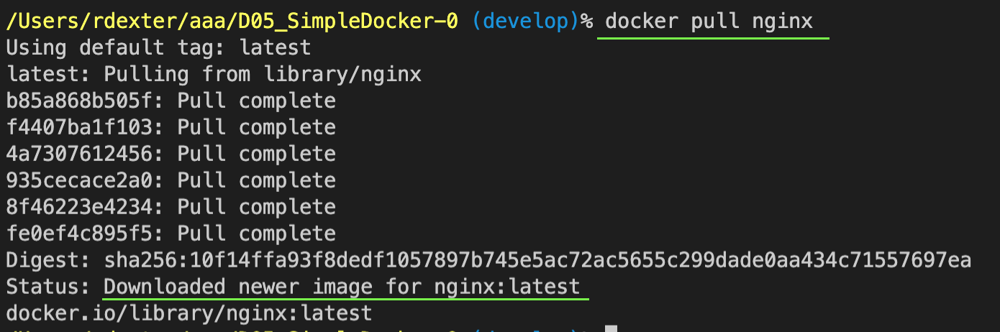
- Проверим наличие докер образа через `docker images`
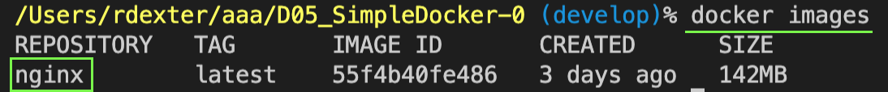
- Запустим докер образ через `docker run -d [image_id|repository]`
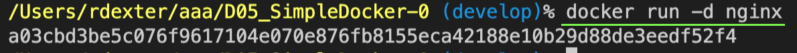
- Проверим, что образ запустился через `docker ps`
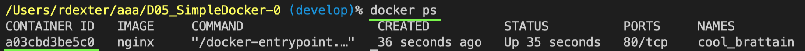
- Посмотрим информацию о контейнере: размер контейнера
`docker inspect [container_id|container_name] --size | grep "\"SizeRootFs\""` 
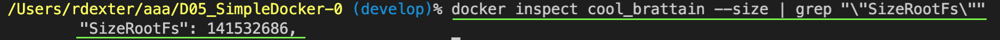
- Посмотрим информацию о контейнере: ip address
`docker inspect [container_id|container_name] | grep "\"IPAddress\"" -m1` 
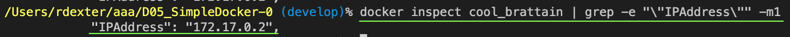
- Посмотрим информацию о контейнере: замапленные порты
`docker inspect [container_id|container_name] | grep "\"Ports\"" -A2   ` 
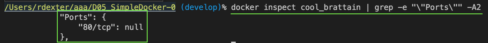
- Остановим докер образ через `docker stop [container_id|container_name]`
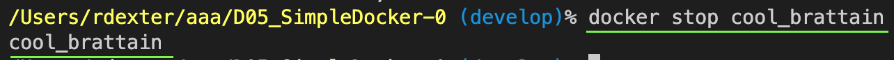
- Проверим, что образ остановился через `docker ps`
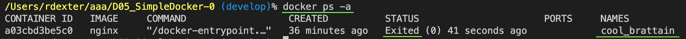
- Запустим докер с замапленными портами 80 и 443 на локальную машину через команду run:
`docker run -d -p 80:80 -p 443:80 nginx`
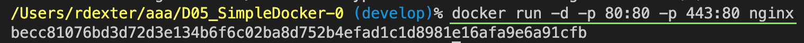
- Проверим, что образ остановился через `docker ps`
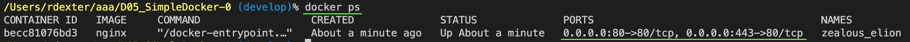
- Проверим, что в браузере по адресу localhost:80 доступна стартовая страница nginx
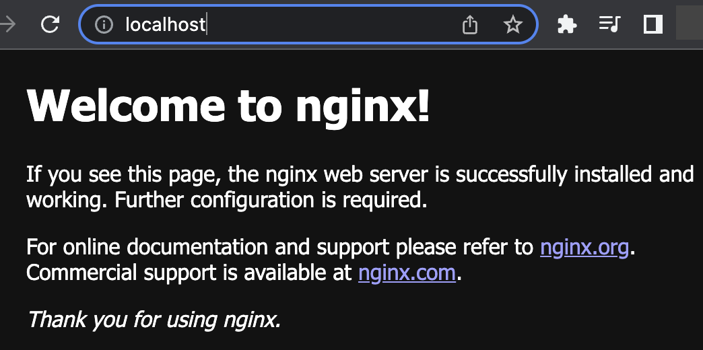
- Проверим, что в браузере по адресу localhost:443 доступна стартовая страница nginx
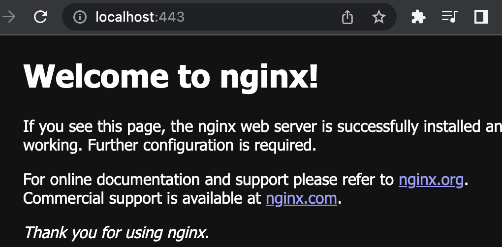
- Перезапустим докер контейнер через `docker restart [container_id|container_name]`
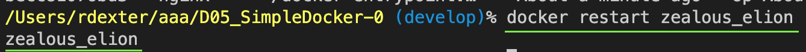
- Проверим любым способом, что контейнер запустился через `docker ps -a`
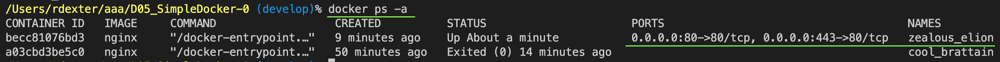

## Part 2. Операции с контейнером

- Прочитаем конфигурационный файл nginx.conf внутри докер образа через команду 
`docker exec silly_bose cat /etc/nginx/nginx.conf`
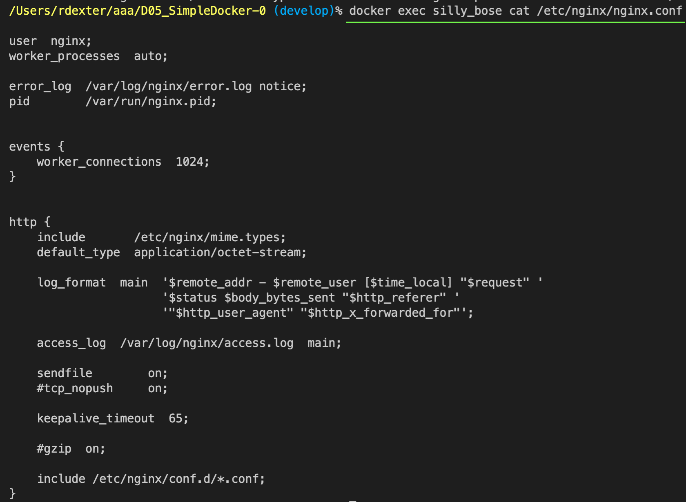
- Создадим на локальной машине файл nginx.conf и настроим в нем по пути /status 
отдачу страницы статуса сервера nginx
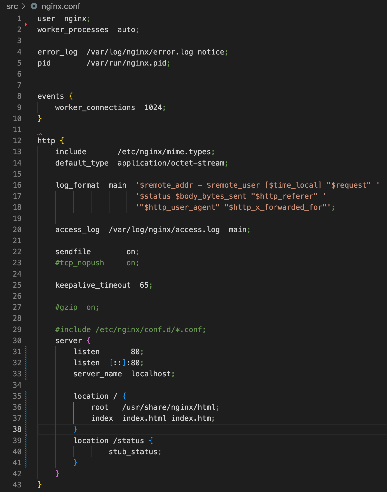
- Скопируем созданный файл nginx.conf внутрь докер образа через команду 
`docker cp nginx.conf silly_bose:/etc/nginx`
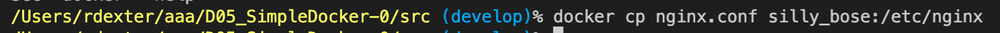
- Перезапустим nginx внутри докер образа через команду `docker exec silly_bose nginx -s reload`
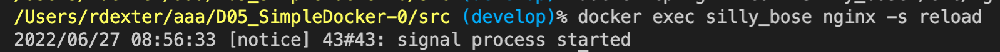
- Проверим, что по адресу localhost:80/status отдается страничка со статусом сервера nginx 
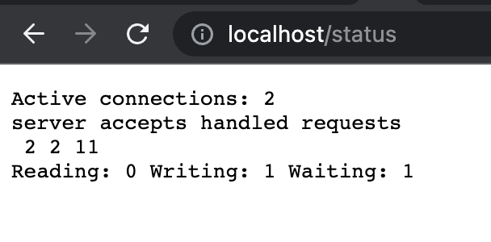
- Экспортируем контейнер в файл container.tar через команду `docker export silly_bose > container.tar`
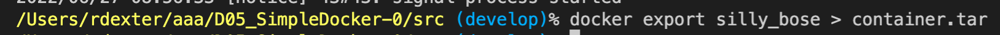
- Остановим контейнер `docker stop silly_bose`
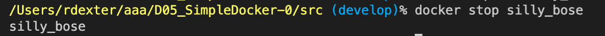
- Удалим образ через `docker rmi -f nginx`, не удаляя перед этим контейнеры
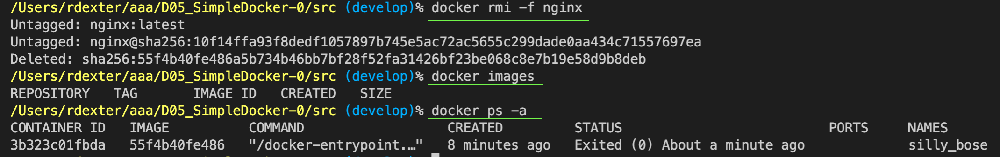
- Удалим остановленный контейнер `docker rm silly_bose`
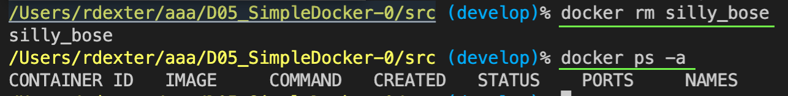
- Импортируем контейнер обратно через команду `docker import container.tar`
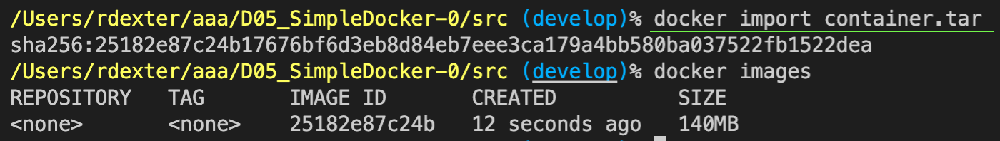
- Запустим импортированный контейнер, обязательно пишем `nginx -g 'daemon off;'`, 
либо entrypoint.sh, так как при экспорте копируется не вся информация
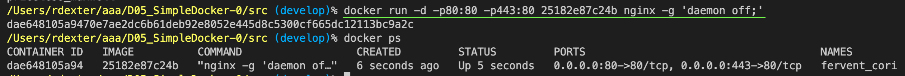
- Проверим, что по адресу localhost:80/status отдается страничка со статусом сервера nginx
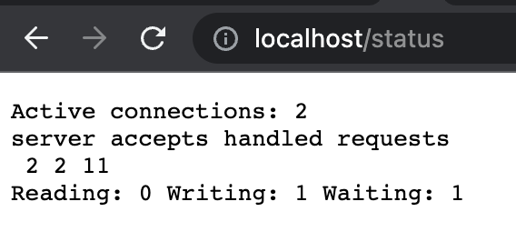

## Part 5. Dockle
- Установим Dockle через brew. Видим типовые ошибки с удалением временных файлов после установки
утилит и использованием root вместо создания нового пользователя
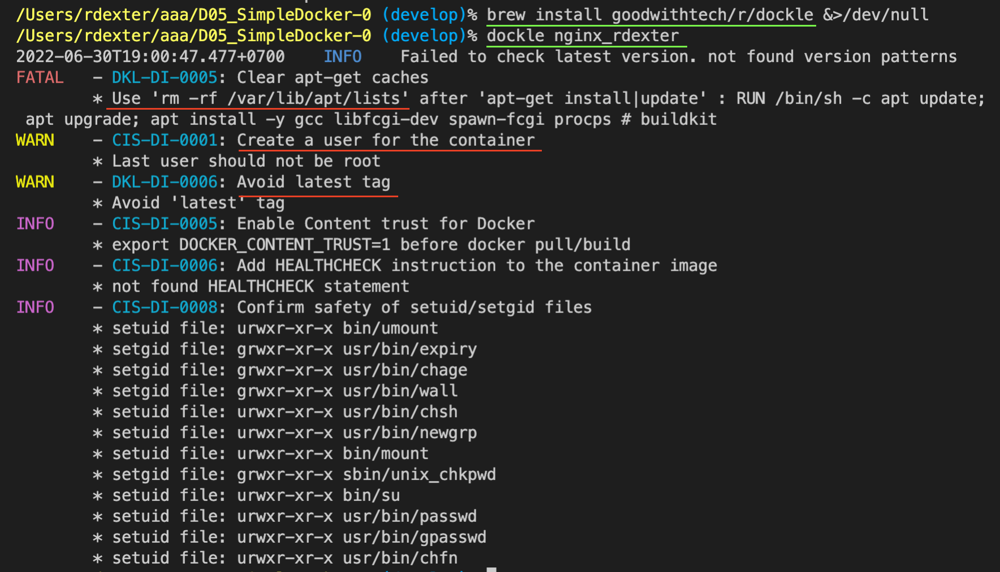
- Создали новый файл Dockerfile_part5 и в нём устранили ошибки
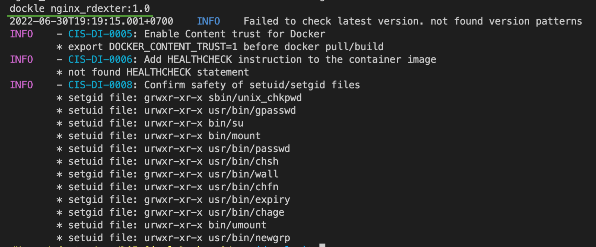