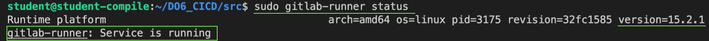
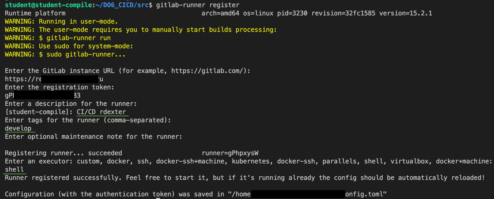
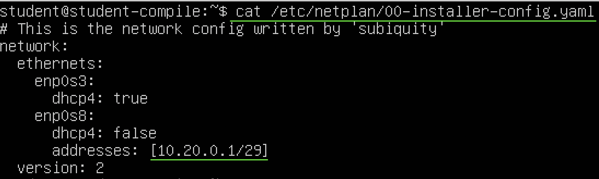
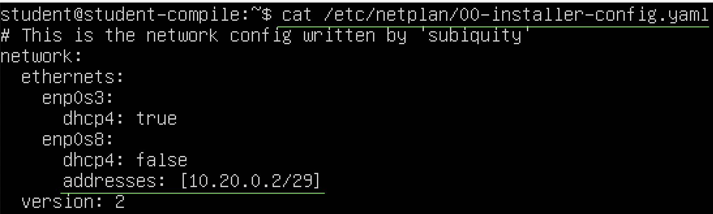

# CI/CD by @rdexter

## Contents

1. [Установка и настройка GitLab runner](#part-1-настройка-gitlab-runner)

## Part 1. Настройка gitlab-runner

- Скачаем на Linux дистрибутив gitlab-runner для архитектуры amd64 
`curl -LJO "https://gitlab-runner-downloads.s3.amazonaws.com/latest/deb/gitlab-runner_amd64.deb"` 
Подробная инструкция по установке на GNU/Linux здесь: 
`https://docs.gitlab.com/runner/install/linux-manually.html`
- Установим gitlab-runner с помощью dpkg: 
`sudo dpkg -i gitlab-runner_amd64.deb`
- Проверим, что у нас самая свежая версия gitlab-runner и статус раннера: `sudo gitlab-runner status` Если у тебя версия что-нибудь типа 11, то это полное фуфло, сноси раннер и переустанавливай нормально.

- Зарегистрируем GitLab runner на платформе gitlab: `gitlab-runner register`. Данные возьмем с платформы Школы 21, в таске проекта.
Обязательно указываем тег и в качестве исполнителя руннера выбираем `shell`. Если вдруг что-то пошло не так и ты решил заново регистрировать раннер, измени регистрационные данные (description  и tag), потому что я подозреваю, что эти теги уже зареганы в системе, но воспользоваться старыми регистрационными данными ты не можешь, и у тебя нет панели администратора для удаления ненужных учетных данных.

## Part 6. Этап деплоя. Подключение для gitlab_cicd по ssh
- Соединим 2 виртуалки в одну сеть, прописываем в VirtualBox настройки внутренней сети в адаптеры.
- Прописываем ip_адреса в виртуальных машинах `sudo vim /etc/netplan/00-installer-config.yaml`

- Не забываем применить настройки `sudo netplan apply`

### На второй машине.
- Создаем пароль для пользователя root: `sudo passwd root`
- Проверим, что в файле `/etc/ssh/sshd_config` установлена настройка `PasswordAuthentication yes`
- Проверим, что существует директория `/root/.ssh`

### На первой машине.
- Добавим пользователя gitlab-runner в группу student (есть sudo права): `sudo usermod -aG student gitlab-runner`
- Генерим ключ `ssh-keygen` под пользователем gitlab-runner: `/home/gitlab-runner/.ssh/id_rsa`
- Далее копируем публичный ключ на вторую машину `scp /home/student/.ssh/id_rsa.pub root@10.20.0.2:/root/.ssh`

### На второй машине.
- Копируем файл id_rsa.pub `sudo cp /root/.ssh/id_rsa.pub /root/.ssh/authorized_keys’
- Прописываем такие настройки в файле sshd_config `sudo vim /etc/ssh/sshd_config`
`PermitRootLogin yes` 
`PubkeyAuthentication yes` 
`PasswordAuthentication no` 
`ChallengeResponseAuthentication no` 

- Перезапускаем демона ssh `sudo systemctl reload ssh`
- Теперь должно получится правильное соединение по ssh без использования пароля (только по ключу)
